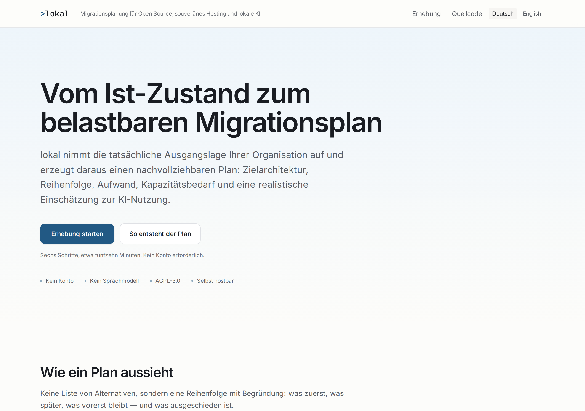
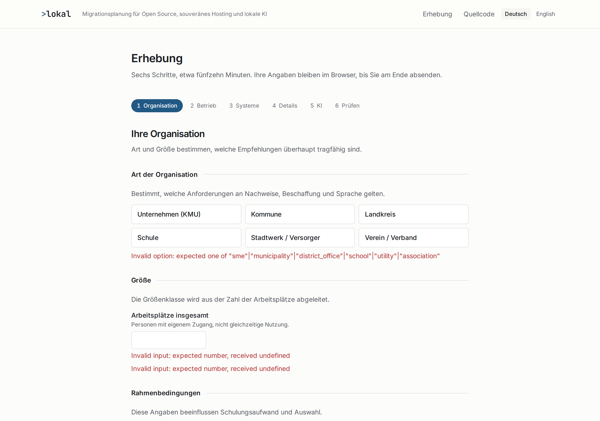
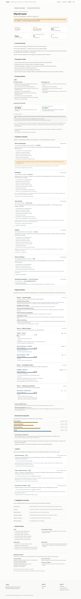

# lokal

**Planungswerkzeug für den Umstieg auf Open-Source-Arbeitswerkzeuge, souveränes
Hosting und lokale KI.**

">lokal" nimmt die tatsächliche Ausgangslage einer Organisation auf und erzeugt daraus
einen nachvollziehbaren Migrationsplan: Zielarchitektur, Reihenfolge, Aufwand,
Kapazitätsbedarf, Einsparperspektive und eine realistische Einschätzung, welche
KI-Anwendungsfälle heute tragfähig sind.

> Status: v0.1.0 — erste vollständige Fassung. Deutsch und Englisch vollständig,
> Regelwerk als Entwurf gekennzeichnet.

## What lokal is

lokal turns a structured description of an organization — seats, departments, IT
maturity, admin capacity, hosting preference, current tools, urgency, criticality,
AI posture — into a planning brief that answers:

- What should we replace first, and what can stay for now?
- Which target stack fits _this_ organization, and why?
- How many seats does each change affect?
- Where are we underprepared, and where do we likely need external support?
- Which AI use cases are realistic now, and which should wait?
- What are the risks, blockers, training needs and likely savings areas?

The output is a shareable brief: a polished report in the app, a Markdown export,
and a print-optimized version you can save as PDF and hand to management.

## Who it is for

- Small and mid-sized companies (SMEs)
- Municipalities and district offices
- Schools
- Public utilities
- Associations and civic organizations

The first market is Germany; the architecture is reusable for Europe later.

## What lokal is **not**

This section is deliberately near the top.

- **Not an alternatives directory.** A chatbot can already suggest replacement
  tools. lokal exists for the part that comes after: sequencing, capacity, risk,
  readiness and rollout.
- **Not an AI wrapper.** No language model is involved in producing a plan.
  Recommendations come from explicit, versioned rules over structured input. The
  same answers always produce the same report.
- **Not a cost calculator.** lokal states savings as qualitative bands with named
  drivers and offsets. It also puts two euro figures beside that band, and
  invents neither. The first is what your current subscriptions cost: your own
  declared seat count times a price the vendor publishes, shown with the plan,
  the source link and the date it was read, for the areas where such a price
  exists ([ADR-0003](docs/adr/0003-priced-exposure-from-published-list-prices.md)).
  The second is what the migration costs: the effort days lokal computed, times a
  day rate _you_ entered — and if you enter none, there is no second figure at
  all, never a zero
  ([ADR-0004](docs/adr/0004-declared-rates-for-the-cost-side.md)). The two are
  **not subtractable**, and the report says so between them: lokal prices neither
  the hosting of the new stack, nor its support contracts, nor the productivity
  loss during the changeover. It never states a net saving, an ROI, a payback
  period or a break-even point.
- **Not a compliance tool.** Where legal duties apply (GoBD, retention, archival
  law), lokal flags them and tells you to verify with your own advisors.
- **Not a procurement or migration execution system.** It plans; it does not
  migrate, integrate or purchase.

## Stack

| Concern     | Choice                                                  |
| ----------- | ------------------------------------------------------- |
| Framework   | Next.js 16 (App Router, React Server Components)        |
| Language    | TypeScript, strict, `noUncheckedIndexedAccess`          |
| Styling     | Tailwind CSS v4, CSS custom properties as design tokens |
| Validation  | Zod — intake, rulepack and report document              |
| Forms       | React Hook Form                                         |
| i18n        | next-intl, German default, English wired                |
| Persistence | Prisma + SQLite (PostgreSQL-ready)                      |
| Tests       | Vitest; Playwright for one end-to-end smoke test        |
| Charts      | none — indicators are CSS-only, so they print reliably  |

No external services are required to run lokal. No API keys, no model providers,
no third-party analytics. Builds work offline: fonts are committed to the
repository and loaded locally, and rules ship as source. Nothing is fetched at
build time, which matters for the networks a good part of this audience builds
inside — see [`src/app/fonts/README.md`](src/app/fonts/README.md).

## Local setup

Requires Node.js 20.9+ and pnpm.

```bash
pnpm install
cp .env.example .env
pnpm dev
```

Then open <http://localhost:3000>.

Useful scripts:

```bash
pnpm check       # format check, lint, typecheck, tests
pnpm test        # unit and golden-fixture tests
pnpm test:e2e    # browser suite: wizard → report → Markdown → print, plus axe
pnpm build       # production build
```

`pnpm check` is the fast inner loop and needs no browser. `pnpm test:e2e` builds
the app, serves it on port 3100 against its own `e2e.db`, and drives it in
Chromium; the first run downloads the browser with
`pnpm exec playwright install chromium`. Both run on every pull request. See
[docs/testing.md](docs/testing.md) for what each layer covers and where the
accessibility bar is set.

## Docker

### Prerequisites

- Docker Engine.
- The `docker compose` plugin (Docker Compose v2.24 or later — bundled with
  current Docker Desktop and Docker Engine installs). The legacy standalone
  `docker-compose` v1 binary does not support the startup ordering
  (`depends_on: ... condition: service_completed_successfully`) that
  `docker-compose.yml` uses to run migrations before the app starts, nor the
  optional `env_file` (see "Configuration" below); if `docker compose version`
  fails, update Docker rather than falling back to `docker-compose`.

No API keys or third-party services are required — the container never
phones home.

### Quick start

```bash
git clone https://github.com/richardkfm/lokal.git
cd lokal
docker compose up --build
```

Then open <http://localhost:3000>. First build takes a few minutes;
subsequent runs reuse Docker's layer cache.

`docker compose up --build` runs two containers, in order:

1. `migrate` — a one-off step that applies pending Prisma migrations to the
   SQLite file on the shared `data` volume, then exits successfully.
2. `app` — the Next.js server, started only once `migrate` has exited `0`.
   It runs from a minimal runtime image built with Next's
   `output: "standalone"`, as a non-root user, and does **not** bundle the
   Prisma CLI — that's why `migrate` is a separate service built from an
   earlier, heavier build stage (see `Dockerfile`).

Run it in the background instead with `docker compose up --build -d`, and
follow logs with `docker compose logs -f app`.

### Configuration

`DATABASE_URL` and `NEXT_PUBLIC_BASE_URL` are fixed in `docker-compose.yml`
because they're container-specific (a path on the `data` volume, a URL the
app needs at request time):

| Variable               | Default (in `docker-compose.yml`) | Notes                                                                                                                                                                |
| ---------------------- | --------------------------------- | -------------------------------------------------------------------------------------------------------------------------------------------------------------------- |
| `DATABASE_URL`         | `file:/data/lokal.db`             | Path inside the container, on the `data` volume. Change together in both the `migrate` and `app` services if you change it.                                          |
| `NEXT_PUBLIC_BASE_URL` | `http://localhost:3000`           | Used for absolute links in shared reports. Set this to your real domain (e.g. `https://lokal.example.org`) before handing out report links from a deployed instance. |

To override either, edit `docker-compose.yml` directly, or add a
`docker-compose.override.yml` alongside it (Compose merges it automatically)
so your changes don't conflict with future `git pull`s of this repo. Note
that Compose merges list-valued keys like `ports:` by concatenation, not
replacement — an override file adding a second `ports:` entry publishes
_both_ ports rather than replacing the first, which usually isn't what you
want. For the published port specifically, use `LOKAL_PORT` below instead.

Everything else — `LOKAL_EXPERT_*` ("Offering help" below), `LOKAL_LEGAL_*`
(imprint/privacy/accessibility links) and `LOKAL_PORT` (the published host
port) — is optional and operator-specific, so it's read from a project-root
`.env` instead (copy `.env.example` to `.env` and fill in what applies).
`LOKAL_EXPERT_*`/`LOKAL_LEGAL_*` use the same file and variables as local,
non-Docker development, and are read by the app itself once per request, so
changing them needs a container restart, not a rebuild: `docker compose up
-d`. `LOKAL_PORT` is different — it's read by the `docker compose` CLI, not
the app, to fill in `docker-compose.yml`'s `ports:` mapping before any
container starts, so it also only needs `docker compose up -d`, not a
rebuild, but changing it does recreate the `app` container. `.env` is
gitignored, so none of this ever ends up in a commit or a `git pull`
conflict. Unset stays unset throughout — a default install without a `.env`
behaves exactly as before.

### Offering help

lokal produces a plan and then stops, and its capacity section frequently tells
an organization they will need outside help. If you run an instance and can be
that help, set these and a contact block appears on the landing page and at the
end of every report — including the printed copy that gets forwarded to a council
or a board:

| Variable             | Notes                             |
| -------------------- | --------------------------------- |
| `LOKAL_EXPERT_NAME`  | Required for the block to appear. |
| `LOKAL_EXPERT_ORG`   | Optional organization name.       |
| `LOKAL_EXPERT_EMAIL` | Rendered as a `mailto:` link.     |
| `LOKAL_EXPERT_PHONE` | Rendered as a `tel:` link.        |
| `LOKAL_EXPERT_URL`   | Rendered as a link.               |
| `LOKAL_EXPERT_NOTE`  | One sentence on what you do.      |

A name plus at least one of email, phone or URL is the minimum; with less than
that nothing is shown. These are read per request, so changing them needs a
restart, not a rebuild.

Nothing is stored or sent: the block renders links, not a form, so no enquiry
data is collected and no mail server is required. The block says plainly that
the contact was configured by the instance operator and that lokal does not vet
or endorse anyone.

### Updating

After pulling new code (including a new database migration):

```bash
git pull
docker compose up --build
```

This rebuilds both images and reruns `migrate` — which only applies
migrations it hasn't applied yet — before restarting `app`. There's nothing
extra to run by hand.

To apply migrations without also starting the app (for example to check a
schema change ahead of time):

```bash
docker compose run --rm migrate
```

### Backups

The SQLite database persists in the named `data` volume across container
restarts and rebuilds. To back it up:

```bash
docker compose stop app
docker run --rm -v lokal_data:/data -v "$PWD":/backup debian:bookworm-slim \
  cp /data/lokal.db /backup/lokal-backup.db
docker compose start app
```

(`lokal_data` is the default project-prefixed volume name; run `docker
volume ls` to confirm it if you renamed the project or the `data` volume.)

To restore, stop `app`, copy the backup file back into the volume the same
way, and start `app` again.

### Stopping and removing

```bash
docker compose down        # stops and removes containers; the data volume is kept
docker compose down -v     # also deletes the data volume — this destroys the database
```

### Building and running without Compose

```bash
docker build -t lokal-migrate --target builder .
docker run --rm -e DATABASE_URL="file:/data/lokal.db" -v lokal-data:/data \
  lokal-migrate pnpm exec prisma migrate deploy

docker build -t lokal .
docker run -p 3000:3000 -e DATABASE_URL="file:/data/lokal.db" -v lokal-data:/data lokal
```

The database file must have its schema migrated before the app can read or
write assessments. Plain `docker build -t lokal .` builds only the final
`runner` stage, which has no Prisma CLI (that's the whole point of the
`migrate`/`app` split above) — so migrations have to run against a
`--target builder` image, as shown, or via `pnpm db:deploy` from a local
checkout pointed at the same `DATABASE_URL`.

### Troubleshooting

- **"relation/table does not exist" or similar errors when submitting an
  assessment** — migrations haven't been applied to the volume the `app`
  container is using. Run `docker compose run --rm migrate` and restart
  `app`.
- **Port 3000 already in use** — change the host side of the port mapping in
  `docker-compose.yml`, e.g. `"8080:3000"`, and open that port instead.
- **`docker compose up` exits immediately with the `app` service never
  starting** — check `docker compose logs migrate`; if the migration step
  failed, `app` is correctly refusing to start against an unmigrated
  database.

## Architecture

```
intake → NormalizedAssessment → pure engine stages → PlanningReport (typed JSON)
                                                            │
                        ┌───────────────────────────────────┼──────────────┐
                        ▼                                   ▼              ▼
                 report view (screen)              Markdown export   print route
```

`PlanningReport` is a versioned, validated JSON document and the only contract
between the engine and every renderer. The engine is pure: no React, no database,
no i18n runtime. It emits rationale codes with parameters, and renderers translate
them — which is why the same inputs always produce the same plan, and why every
recommendation can be traced back to the answers that caused it.

Reports are not stored. Only the intake answers and the rulepack version are
persisted; the report is recomputed on every render.

See [`docs/architecture.md`](docs/architecture.md) for the full picture, and
[`docs/adr/`](docs/adr/) for the decisions behind it.

## MVP scope (v0.1.0)

- Landing page
- Six-step intake wizard (organization, operating model, current stack, migration
  detail, AI posture, review)
- Deterministic planning engine with full rationale traceability
- Rulepack covering nine categories plus an AI use-case catalog, including
  Euro-Office and published vendor list prices
- Polished report view with an at-a-glance summary and nine sections
- Markdown export
- Print-optimized report route
- German and English content complete, both proved by the browser suite

All of the above is implemented and released as `v0.1.0`. What comes next is in
[`plans/roadmap.md`](plans/roadmap.md); every rulepack entry still ships as
`draft` until a human has checked it against a current release, and the report
says so on its cover.

### Screenshots

Current development build, German locale, from the `municipality-180` reference
persona in [`tests/fixtures/personas.ts`](tests/fixtures/personas.ts).

| Landing page                                                                  | Intake wizard                                                                  | Report                                                                                                     |
| ----------------------------------------------------------------------------- | ------------------------------------------------------------------------------ | ---------------------------------------------------------------------------------------------------------- |
| [](docs/screenshots/landing.png) | [](docs/screenshots/wizard.png)   | [](docs/screenshots/report.png)                                 |
| Shows what a plan actually looks like, then what lokal explicitly is not.     | Step 1 of 6: organization type and size drive every recommendation downstream. | At-a-glance summary — readiness, savings band, affected seats, phases — above the full nine-section brief. |

## Roadmap

| Version | Focus                                                                  |
| ------- | ---------------------------------------------------------------------- |
| v0.1.0  | Clickable MVP: wizard, engine, report, Markdown export, print route    |
| v0.2.0  | Better scoring, stronger report quality, German/English polish         |
| v0.3.0  | Saved sessions and profiles, richer org modelling, server-side PDF     |
| v0.4.0  | Sector templates, stronger capacity guidance, deeper local-AI advisory |
| v1.0.0  | Production-ready planning tool for German SMEs and local public bodies |

Details in [`plans/roadmap.md`](plans/roadmap.md).

## Limitations

Worth stating plainly, because a planning tool that oversells itself is worse than
none:

- **Self-declared input.** lokal does not scan your network or discover systems. A
  plan is only as good as the answers it was given.
- **Rules are a snapshot.** Tool recommendations reflect a rulepack reviewed on a
  stated date. Verify current facts before making a procurement decision.
- **Effort figures are planning estimates,** expressed as ranges and bands. They
  are not quotes and not commitments.
- **Euro figures are list prices, not your contract.** They are published vendor
  prices times the seats you declared, and they cover only the areas where such a
  price could be cited — the report states how many. Negotiated terms, framework
  agreements and discounts are invisible to lokal, so check the figure against
  your own invoices.
- **Cost figures are your own rate times an estimated range.** The migration cost
  is the effort band times the day rate you entered. The band is a planning
  estimate, so the cost is one too, and it covers internal and external effort
  only — not hosting, not support contracts for the new stack, not lost
  productivity during the changeover.
- **The operating-system lane says whether and when, not which.** lokal assesses
  whether the desktop can move, what blocks it, and where it belongs in the
  sequence. It does not recommend a distribution.
- **No compliance guarantees.** Legal and archival duties need your own advisors.
- **Reports are not access-controlled in v0.1.0.** Report links are unguessable but
  not secret. Treat them as internal documents.

## License

[AGPL-3.0-only](LICENSE). A tool that argues for software sovereignty should be
inspectable and self-hostable by the organizations that rely on it.
